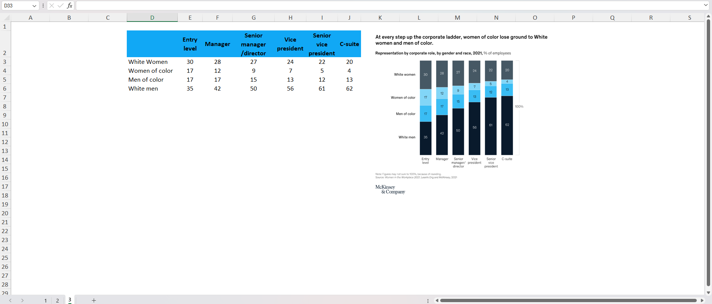

# **<u>McKinsey Visuals Data Visualization Project</u>**

This Excel project leverages data extracted from McKinsey Visuals to create insightful visualizations on three key aspects:

**Technology's Impact on Business Transformations:** Through interactive charts and graphs, the project highlights how technology plays a pivotal role, contributing up to 71 per cent of the value derived from business transformations across various sectors.

**Quarterly Machinery Sector M&A Activity:** The project provides a comprehensive overview of mergers and acquisitions (M&A) within the machinery sector on a quarterly basis. Using McKinsey's data, it uncovers trends and patterns in M&A activity, offering valuable insights for industry stakeholders.

**Representation by Corporate Role, Gender, and Race (2021)**: Delving into diversity and inclusion within corporate settings, the project visualizes representation across different corporate roles by gender and race. This analysis sheds light on the current state of diversity in corporate environments, helping to foster awareness and drive initiatives for greater inclusivity.

These visualizations are designed to offer stakeholders and decision-makers actionable insights derived from robust data analysis, facilitating informed decision-making and a deeper understanding of industry dynamics and societal trends.
